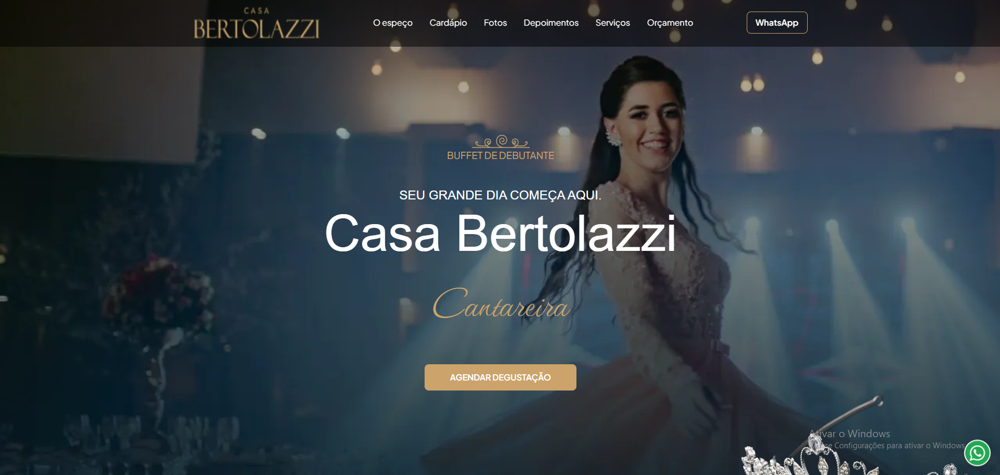

# 🏡 Casa Bertolazzi

### Landing page desenvolvida com foco em experiência visual, apresentação institucional e conversão

🔗 **Demonstração ao vivo:**
https://thiago-tsg.github.io/casa-bertolazzi/

---

## 📸 Prévia



---

## ✨ Sobre o projeto

O **Casa Bertolazzi** é uma landing page desenvolvida para apresentar de forma elegante e estratégica os espaços, serviços e diferenciais da marca.

O projeto foi construído com foco em criar uma experiência visual envolvente, valorizando a apresentação dos ambientes, a proposta gastronômica e os principais elementos responsáveis pela tomada de decisão do usuário. A marca destaca eventos, espaços sofisticados e gastronomia assinada pelo chef Carlos Bertolazzi.

---

## 🎯 Objetivo

Desenvolver uma página capaz de:

* fortalecer a presença digital da marca
* destacar diferenciais e propostas de valor
* apresentar ambientes e serviços de forma atrativa
* gerar oportunidades comerciais através da captação de leads
* proporcionar uma navegação intuitiva e responsiva

---

## 💡 Abordagem

O projeto foi estruturado com foco em:

* hierarquia visual clara
* comunicação objetiva
* valorização do conteúdo visual
* performance de carregamento
* adaptação para múltiplos dispositivos

A construção da interface prioriza uma experiência fluida, permitindo que o usuário explore os espaços, serviços e informações institucionais de maneira natural.

---

## ⚙️ Funcionalidades

* 📱 Layout totalmente responsivo
* 🖼️ Galeria visual de ambientes
* 🎨 Estrutura institucional moderna
* 📍 Apresentação de unidades e espaços
* 📋 Sessões organizadas para comunicação de serviços
* 📞 Chamadas para ação estratégicas
* ⚡ Navegação otimizada
* 🚀 Build automatizado para produção

---

## 🧠 Destaques técnicos

### ⚡ Performance

* Minificação de arquivos CSS e JavaScript
* Otimização de assets para produção
* Organização de recursos estáticos
* Estrutura preparada para deploy

### 🎨 Experiência do usuário

* Navegação intuitiva
* Hierarquia visual orientada à conversão
* Layout adaptável para desktop e mobile
* Distribuição estratégica de conteúdo

### 🧱 Arquitetura

* Separação entre ambiente de desenvolvimento e produção
* Estrutura modular de estilos
* Organização de assets e componentes
* Workflow automatizado com Gulp

---

## 🔄 Fluxo de UX

1. Apresentação da marca
2. Exibição dos principais diferenciais
3. Exploração dos ambientes
4. Conhecimento dos serviços oferecidos
5. Reforço de autoridade e credibilidade
6. Conversão através do contato

---

## 🛠️ Stack Tecnológica

* HTML5
* SCSS
* JavaScript
* Gulp.js
* BrowserSync
* Browserify
* Babel
* Imagemin
* Node.js

---

## 🚀 Como executar

```bash
git clone https://github.com/thiago-tsg/casa-bertolazzi.git
cd casa-bertolazzi
npm install
```

### Ambiente de desenvolvimento

```bash
gulp
```

### Build de produção

```bash
gulp build
```

---

## 📦 Pipeline de automação

O projeto utiliza Gulp para automatizar diversas etapas do desenvolvimento:

* Compilação de SCSS
* Bundling de JavaScript
* Minificação de arquivos
* Processamento de imagens
* Organização de assets
* Live Reload
* Geração do build final

---

## 👨‍💻 Contexto profissional

Este projeto foi desenvolvido durante minha atuação na **Tecna**, aplicando conceitos de:

* desenvolvimento front-end
* construção de landing pages institucionais
* otimização de performance
* automação de workflows
* organização de projetos para produção

---

## 👨‍💻 Autor

**Thiago Gonçalves**

* GitHub: https://github.com/thiago-tsg
* Portfólio: https://thiago-tsg.github.io/Portifolio/
* Projeto: https://thiago-tsg.github.io/casa-bertolazzi/
